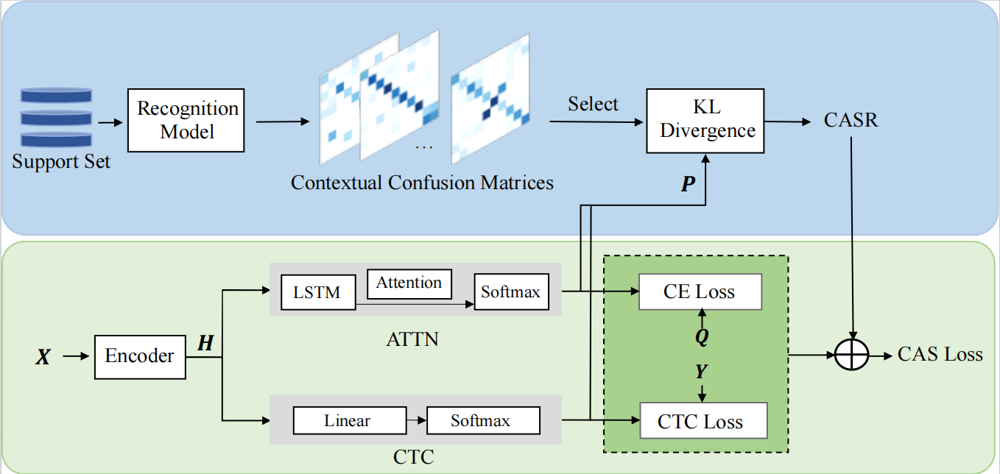

# Context-Aware Selective Regularization for General Sequential Confidence Calibration

<!-- <p align="center">
<a href="https://arxiv.org/pdf/2404.04624.pdf">"></a>
</p> -->

This is the official PyTorch implementation for the paper: "Context-Aware Selective Regularization for General Sequential Confidence Calibration".<br><br>



## Runtime Environment

- This work was tested with PyTorch 1.13.1, CUDA 11.7, python 3.7 <br> 
- requirements : lmdb, pillow, torchvision, nltk, natsort, numpy
```
pip3 install lmdb pillow torchvision nltk natsort numpy
```

## Datasets
We use lmdb dataset for training, support, and evaluation dataset.
The datasets can be downloaded in [clovaai](https://github.com/clovaai/deep-text-recognition-benchmark#download-lmdb-dataset-for-traininig-and-evaluation-from-here)

* Training datasets
    * [MJSynth (MJ)](https://www.robots.ox.ac.uk/~vgg/data/text/)
    * [SynthText (ST)](https://www.robots.ox.ac.uk/~vgg/data/scenetext/)
* validation datasets (Support set)
    * The union of the training set of [ICDAR2013 (IC13)](https://rrc.cvc.uab.es/?ch=2), [ICDAR2015 (IC15)](https://rrc.cvc.uab.es/?ch=4), [IIIT5K (IIIT)](http://cvit.iiit.ac.in/projects/SceneTextUnderstanding/IIIT5K.html), and [Street View Text (SVT)](http://www.iapr-tc11.org/mediawiki/index.php/The_Street_View_Text_Dataset)
* Evaluation datasets
    * Regular datasets 
        * [IIIT5K (IIIT)](http://cvit.iiit.ac.in/projects/SceneTextUnderstanding/IIIT5K.html) 
        * [Street View Text (SVT)](http://www.iapr-tc11.org/mediawiki/index.php/The_Street_View_Text_Dataset) 
        * [ICDAR2013 (IC13)](https://rrc.cvc.uab.es/?ch=2) 
        * [ICDAR2003 (IC03)](http://www.iapr-tc11.org/mediawiki/index.php/ICDAR_2003_Robust_Reading_Competitions) 
    * Irregular dataset
        * [ICDAR2015 (IC15)](https://rrc.cvc.uab.es/?ch=4) 
        * [Street View Text Perspective (SVTP)](https://openaccess.thecvf.com/content_iccv_2013/papers/Phan_Recognizing_Text_with_2013_ICCV_paper.pdf) 
        * [CUTE80 (CUTE)](http://cs-chan.com/downloads_CUTE80_dataset.html) 
* Tree structure of `data` directory
    ```
    data_lmdb_release
    ├── charset_36.txt
    ├── charset_94.txt
    ├── test
    ├── training
    │   ├── MJ
    │   │   ├── MJ_test
    │   │   ├── MJ_train
    │   │   └── MJ_valid
    │   └── ST
    └── validation
    ```
## Calibration
Take TRBA as an example.
1. Get Confusion Matrices
```
CUDA_VISIBLE_DEVICES=0 python test.py \
--Transformation TPS --FeatureExtraction ResNet --SequenceModeling BiLSTM --Prediction Attn \
--eval_data /path/to/support/dataset --saved_model /path/to/checkpoint --json_path /path/to/evaluation/result
```
* `--eval_data`: path to support dataset.
* `--saved_model`: path to model to be calibrated.
* `--json_path`: path to evaluation result of support dataset.
```
CUDA_VISIBLE_DEVICES=0 python calibration/get_confusion_matrices.py \
--Prediction Attn --support_set_res_path /path/to/evaluation/result --saved_path confusion_matrices 
```
* `--support_set_res_path`: path to evaluation result of support dataset.
* `--saved_path`: path to save confusion matrices.
2. Calibrate Model with CASR.
```
CUDA_VISIBLE_DEVICES=0 python train.py \
--train_data data_lmdb_release/training --valid_data data_lmdb_release/test \
--select_data MJ-ST --batch_ratio 0.5-0.5 --lr 0.1 \
--Transformation TPS --FeatureExtraction ResNet --SequenceModeling BiLSTM --Prediction Attn \
--saved_model /path/to/checkpoint --calibrator CASR --beta 0.5
```
* `--saved_model`: path to model to be calibrated.
* `--calibrator`: select calibration method.
* `--beta`: weight factor for balancing in the Eq. (12) in our paper. <br> 
Note: Detailed argument settings can be found in [clovaai](https://github.com/clovaai/deep-text-recognition-benchmark).
## Evaluation
```
CUDA_VISIBLE_DEVICES=0 python test.py \
--eval_data data_lmdb_release/evaluation --benchmark_all_eval \
--Transformation TPS --FeatureExtraction ResNet --SequenceModeling BiLSTM --Prediction Attn \
--saved_model saved_models/TPS-ResNet-BiLSTM-Attn-Seed1111/best_accuracy.pth
```
* `--saved_model`: path to calibrated model.

## Calibrated Models Download

Download calibrated model by CASR from this [link](xxxxx). Performances of the calibrated model are:

| Model | ECE(%) | ACE(%) | MCE(%) |
| ------- | :---: | :---: | :---: |
| TRBA | 0.66 |  0.32 |  6.18 |
| TRBC | 0.68 | 0.35 | 4.50  |
| CRNN | 0.71 | 0.55  | 7.49  |

## Acknowledgements
This implementation has been based on [clovaai](https://github.com/clovaai/deep-text-recognition-benchmark).


## Citation
If you find our work useful in your research, please cite the following:
```
@inproceedings{huang2021context,
  title={Context-aware selective label smoothing for calibrating sequence recognition model},
  author={Huang, Shuangping and Luo, Yu and Zhuang, Zhenzhou and Yu, Jin-Gang and He, Mengchao and Wang, Yongpan},
  booktitle={Proceedings of the 29th ACM International Conference on Multimedia},
  pages={4591--4599},
  year={2021}
}
```
